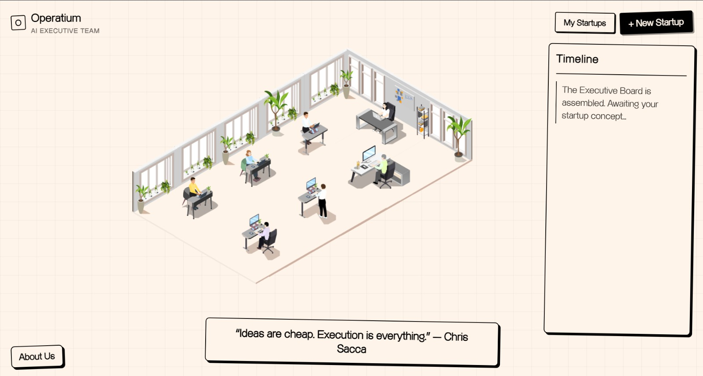

# Operatium: AI Boardroom




Operatium is a local-first, AI-driven business simulation framework. It leverages multiple autonomous AI agents—acting as a CEO, CTO, Product Manager, Growth Lead, and Risk Advisor—to debate, analyze, and validate complex startup ideas and business strategies in real-time.

By running locally via Ollama, Operatium ensures that your proprietary business data remains completely private. It utilizes a highly capable Retrieval-Augmented Generation (RAG) system to ground the AI's logic in real-world startup frameworks and market research.

---

## AI and System Architecture

Operatium is designed to be robust and flexible, with fallback mechanisms built into the core agent graph.

### 1. Main LLM Engine: Local Qwen 3.5
- **Model:** qwen3.5 (via Ollama)
- **Role:** Primary inference engine for all executives. 
- **Why Qwen 3.5:** Highly capable at complex reasoning, instruction following, and maintaining specific persona constraints while being optimized for local hardware inference.

### 2. Fallback Engine: OpenRouter
- **Model:** Configurable (defaults to huggingfaceh4/zephyr-7b-beta or gpt-oss-120b:free)
- **Role:** If the local Ollama server experiences downtime, times out, or lacks capacity, the LangGraph orchestrator automatically routes the execution request to a cloud-based LLM via OpenRouter.

### 3. Knowledge Base and Embeddings
- **Embedding Model:** Google gemini-embedding-001 (requires API key).
- **Vector Database:** Supabase PostgreSQL with the pgvector extension.
- **RAG Resources:** The system's knowledge base is designed to be primed with authoritative startup literature. By default, it operates on principles derived from:
  - **Y Combinator Essays & Playbooks:** For high-growth strategies and fundraising.
  - **The Lean Startup Methodology:** For iterative MVP development and validation.
  - **Modern System Design Interviews:** For scalable technical architecture.
  - **Venture Capital Frameworks:** For financial modeling and risk assessment.

---

## The AI Executive Board

Operatium simulates a full C-suite. Each autonomous agent is strictly prompted to focus purely on their domain expertise and relentlessly debate the startup's flaws before reaching a consensus.

- **CEO (Chief Executive Officer):** Evaluates the overall vision, market opportunity, and acts as the final decision-maker to synthesize the ultimate strategy.
- **CTO (Chief Technology Officer):** Scrutinizes technical feasibility, architecture choices, scalability, and engineering bottlenecks.
- **Product Manager:** Scopes the Minimum Viable Product (MVP), defines user personas, and builds the product roadmap.
- **Product Designer:** Focuses on User Experience (UX), user flows, and interface friction points.
- **Growth & Marketing:** Formulates the Go-To-Market (GTM) strategy, customer acquisition channels, and viral loops.
- **Finance & Operations:** Analyzes revenue models, unit economics, runway, and pricing strategy.
- **Investor & Risk Advisor:** Plays devil's advocate to expose market risks, regulatory hurdles, and scrutinizes investor readiness.

---

## Hardware Requirements

Because Operatium relies on local AI inference, hardware capabilities dictate generation speed.

| Component | Minimum (CPU Only) | Recommended (GPU / Apple Silicon) |
|-----------|---------------------|-----------------------------------|
| **RAM** | 8 GB | 16 GB+ |
| **GPU VRAM** | N/A | 6 GB+ (Nvidia RTX or Apple M-series Unified Memory) |
| **Storage** | 10 GB Free Space (Model weights) | 10 GB Free Space (SSD highly recommended) |
| **Performance**| ~2-5 tokens per second | ~20-50+ tokens per second (Real-time) |

*Note: If you lack the hardware to run the model locally, you can easily switch the main engine to use OpenAI, Anthropic, or OpenRouter by adjusting the .env configuration.*

---

## Detailed Installation Guide

### Step 1: Install System Prerequisites
Ensure the following dependencies are installed on your machine:
1. Node.js (v18+) - For the React frontend.
2. Python (v3.10+) - For the FastAPI backend.
3. Ollama - To run the local models.
4. Git - To clone the repository.

### Step 2: Set up Ollama (Local AI)
Once Ollama is installed on your system, open your terminal and pull the primary model:
```bash
ollama pull qwen3.5
```
*Note: This download requires approximately 4.5GB - 6.6GB depending on the underlying quantization.*

### Step 3: Set up the Supabase Database
Operatium relies on Supabase for data persistence and pgvector for RAG memory.
1. Navigate to Supabase and create a free project.
2. Open the SQL Editor in your Supabase dashboard.
3. Copy the entire contents of the backend/schema.sql file from this repository and execute it. This provisions all necessary tables and security policies.
4. Navigate to Project Settings -> API and copy your Project URL and anon public key.

### Step 4: Configure the Backend
Open a new terminal and navigate to the backend directory:
```bash
cd backend
```

Create and activate a virtual environment:
```bash
# Windows
python -m venv venv
.\venv\Scripts\activate

# Mac/Linux
python3 -m venv venv
source venv/bin/activate
```

Install Python dependencies:
```bash
pip install -r requirements.txt
```

Configure Environment Variables:
Create a file named .env in the backend directory and inject the following keys:
```env
# Required: Supabase Database
SUPABASE_URL="https://your-project-id.supabase.co"
SUPABASE_ANON_KEY="your-anon-key"

# Required: For RAG Embeddings
GOOGLE_API_KEY="your-google-gemini-api-key"

# Optional: Fallback Cloud LLM (If Ollama is offline)
OPENROUTER_API_KEY="your-openrouter-key" 
```

Run the Backend Server:
```bash
python -m uvicorn app.main:app --host 127.0.0.1 --port 8000
```
*The backend should now be listening at http://127.0.0.1:8000.*

### Step 5: Configure the Frontend
Open a new terminal window and navigate to the frontend directory:
```bash
cd frontend
```

Install Node dependencies:
```bash
npm install
```

Configure Environment Variables:
Create a file named .env in the frontend directory:
```env
VITE_API_URL="http://127.0.0.1:8000"
```

Run the Frontend Development Server:
```bash
npm run dev
```

Visit the local URL provided by Vite (usually http://localhost:5173) in your browser to initialize your first boardroom simulation.

---

## Contributing
Contributions, issue reports, and feature requests are welcome. 
1. Fork the Project
2. Create your Feature Branch (git checkout -b feature/Optimization)
3. Commit your Changes (git commit -m 'Implement Model Optimization')
4. Push to the Branch (git push origin feature/Optimization)
5. Open a Pull Request

## License
This project is open-sourced under the MIT License.
